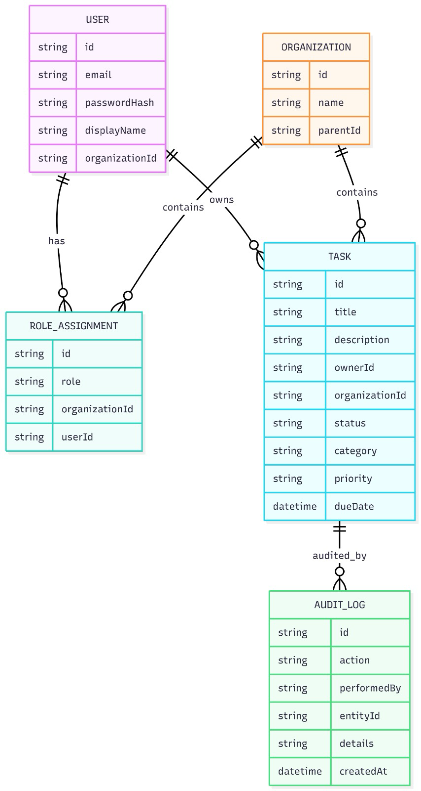

# bkalvakuntla-3fa85f6457174562B3fc2c963f66afa6

This README documents how to run the project, the architecture and shared libraries, the data model (ERD), access control design (RBAC + JWT), API reference with examples, and future considerations for making the system production-ready.

**Table of Contents**

- Setup Instructions
- Architecture Overview
- Data Model (ERD)
- Access Control Implementation
- API Documentation (examples)
- Future Considerations

**Setup Instructions**

- Prerequisites:

  - Node.js (>= 18), npm, and npx
  - SQLite (dev uses in-memory or file-based SQLite)
  - Git (optional)

- Install dependencies:

```bash
npm install
```

- Environment (`.env`) variables (create `.env` at repo root or set in your shell):

```
# JWT
JWT_SECRET=e4b8f1c92a7d3f6b9c2d8a1e5f0b4c6d7a9e3f1b2c4d6f8a0b1c3d5e7f9a2b4
JWT_EXPIRATION=1h

# Database (SQLite example)
DATABASE_URL=sqlite:./dev.db

# App
PORT=3000
```

- Run the backend (api):

```bash
# start api (NestJS app)
export NX_DAEMON=false && npx nx serve api
```

- Run the frontend (dashboard):

```bash
# start dashboard (Angular app) - uses proxy to /api
export NX_DAEMON=false && npx nx serve dashboard -- --proxy-config=apps/dashboard/proxy.conf.json
```

Notes:

- The dashboard proxies `/api` to the backend (see `apps/dashboard/proxy.conf.json`).
- If `4200` is in use, pass `--port=<port>` to `npx nx serve dashboard`.

**Architecture Overview**

- Monorepo: Nx is used to manage a monorepo with `apps/` and `libs/`.

  - `apps/api` — Backend service (NestJS + TypeORM).
  - `apps/dashboard` — Frontend (Angular).
  - `libs/auth` — Shared authentication helpers, guards, and RBAC helpers.
  - `libs/data` — Shared data types, enums, and DTOs used across apps.

- Rationale: sharing `auth` and `data` via workspace libs keeps types and security logic consistent between frontend and backend; Nx makes builds, testing and dependency graphing efficient.

**Data Model (ERD)**

The main domain entities:

- `User` — application user (id, email, passwordHash, organizationId, displayName).
- `Organization` — hierarchical org unit (id, name, parentId).
- `RoleAssignment` — mapping of `User` to a `Role` scoped to an `Organization` (id, role, organizationId, userId).
- `Task` — task record (id, title, description, ownerId, organizationId, status, category, priority, dueDate).
- `AuditLog` — stores actions performed (id, action, performedBy, entityId, details, createdAt).

Mermaid ERD (rendered where supported):



**Access Control Implementation**

- Roles: `OWNER`, `ADMIN`, `VIEWER`.
- Permissions (examples in `libs/data`):

  - `CREATE_ORG`, `CREATE_TASK`, `READ_TASK`, `UPDATE_TASK`, `DELETE_TASK`, `TOGGLE_COMPLETE`, `VIEW_AUDIT`.

- Role → Permissions mapping (in `libs/auth/src/lib/rbac.ts`):

  - `OWNER`: all permissions (create/read/update/delete, view audit).
  - `ADMIN`: create/read/update but not delete (policy decision; can be changed).
  - `VIEWER`: read and toggle completion only.

- Organization hierarchy and inheritance:

  - Storage model:

    - Each `Organization` record has a `parentId` (nullable) forming a tree. Top-level orgs have `parentId = null`.
    - Role assignments (`RoleAssignment`) are scoped to a single organization and contain `userId`, `role`, and `organizationId`.

  - Inheritance rules (effective permissions):

    - `OWNER` and `ADMIN` assignments are inheritable: a role assigned at an ancestor organization applies to descendant organizations (unless a more specific assignment on a descendant overrides it).
    - `VIEWER` is non-inheritable by default and only applies to the exact organization where it was assigned.
    - Permission checks for a resource in `org_X` resolve `org_X`'s ancestor chain and evaluate role assignments on `org_X` and its ancestors to compute effective permissions.

  - Creating tasks in child organizations (server + UX behavior):

    - Server: `POST /api/tasks` accepts an `organizationId`. The controller enforces `CREATE_TASK` for that `organizationId` using the `RbacGuard` and the `userHasPermission()` resolver. If the user has `OWNER` or `ADMIN` on an ancestor of the target organization, creation is allowed.
    - Task record: when created, `Task.ownerId` is set to the authenticated user's id (`sub` from the JWT) and `organizationId` is set to the target org.
    - UI: the task creation modal lists target organizations the user is allowed to create tasks in (resolved via the API or precomputed descendants). Ancestors' children are shown when the user's roles inherit to those descendants.

  - Examples:

    - Alice is `OWNER` for `org_root`. She can create tasks in `org_root` and any descendants (e.g., `org_root -> eng -> frontend`) by specifying `organizationId=frontend` in the `POST /api/tasks` request.
    - Bob is `ADMIN` for `org_sales`. He can create tasks in `org_sales` and its children, but not in unrelated orgs unless he also holds a role there.

  - Notes & constraints:
    - Ownership (`ownerId`) is a task-level property and does not implicitly grant org-level permissions.
    - Audit logs record who created the task and the `organizationId` of the task.
    - The UI restriction is a convenience; all enforcement is server-side and handled by the RBAC guard.

- JWT integration:
  - Login issues a JWT (signed with `JWT_SECRET`) containing `sub`, `email`, `roles` (array of role assignments) and `organizationId`.
  - Requests run through `JwtAuthGuard` to populate `req.user` and then `RbacGuard` which enforces `@Permissions(...)` metadata on controllers.
  - `RbacGuard` uses `userHasPermission(roles, permission, resourceOrgId, orgResolver)` to determine access, where `orgResolver` can resolve an org's parent and enable inheritance checks.

**API Documentation (selected endpoints)**

Base path: `/api`

Auth

- POST /api/auth/register

  - Body: { email, password, organizationId, displayName?, role? }
  - Success: 201 { id, email, role }

- POST /api/auth/login
  - Body: { email, password }
  - Success: 200 { accessToken, expiresIn }

Tasks

- POST /api/tasks (Permissions: CREATE_TASK)

  - Body: { title, description?, organizationId?, dueDate?, category?, priority? }
  - Success: 201 { id, ...task }

- GET /api/tasks?organizationIds[]=... (Permissions: READ_TASK)

  - Query: organizationIds optional; otherwise resolves visible orgs from user's roles
  - Success: 200 [ { task } ]

- PUT /api/tasks/:id (Permissions: UPDATE_TASK)

  - Body: fields to update
  - Success: 200 { updated task }

- DELETE /api/tasks/:id (Permissions: DELETE_TASK)

  - Success: 200 { success: true }

- PATCH /api/tasks/:id/toggle (Permissions: TOGGLE_COMPLETE)
  - Toggles done/todo status

Orgs

- POST /api/orgs (Permissions: CREATE_ORG)
- GET /api/orgs/:id/children
- GET /api/orgs/:id/descendants

Audit

- GET /api/tasks/audit-log (Permissions: VIEW_AUDIT)

## Sample Requests & Responses

Note: All requests that require authentication must include the header `Authorization: Bearer <token>`.

1. Register (POST /api/auth/register)

Request:

```bash
curl -X POST http://localhost:3000/api/auth/register \
	-H 'Content-Type: application/json' \
	-d '{"email":"owner@example.com","password":"secret","organizationId":"org_1","displayName":"Owner User","role":"OWNER"}'
```

Response (201):

```json
{
  "id": "user_abc123",
  "email": "owner@example.com",
  "role": "OWNER"
}
```

2. Login (POST /api/auth/login)

Request:

```bash
curl -X POST http://localhost:3000/api/auth/login \
	-H 'Content-Type: application/json' \
	-d '{"email":"owner@example.com","password":"secret"}'
```

Response (200):

```json
{
  "accessToken": "eyJhbGciOiJI...",
  "expiresIn": "1h"
}
```

3. Create Task (POST /api/tasks) — permission: `CREATE_TASK`

Request:

```bash
curl -X POST http://localhost:3000/api/tasks \
	-H 'Content-Type: application/json' \
	-H 'Authorization: Bearer <token>' \
  -d '{"title":"Prepare report","description":"Monthly financials","organizationId":"org_1","dueDate":"2026-01-20","category":"WORK","priority":"High"}'
```

Response (201):

```json
{
  "id": "task_01",
  "title": "Prepare report",
  "description": "Monthly financials",
  "ownerId": "user_abc123",
  "organizationId": "org_1",
  "status": "TODO",
  "category": "WORK",
  "priority": "High",
  "dueDate": "2026-01-20T00:00:00.000Z",
  "position": 0,
  "createdAt": "2026-01-14T12:00:00.000Z",
  "updatedAt": "2026-01-14T12:00:00.000Z"
}
```

4. List Tasks (GET /api/tasks)

Request:

```bash
curl -X GET 'http://localhost:3000/api/tasks' \
	-H 'Authorization: Bearer <token>'
```

Response (200):

```json
[
  {
    "id": "task_01",
    "title": "Prepare report",
    "description": "Monthly financials",
    "ownerId": "user_abc123",
    "organizationId": "org_1",
    "status": "TODO",
    "category": "WORK",
    "priority": "High",
    "dueDate": "2026-01-20T00:00:00.000Z",
    "position": 0,
    "createdAt": "2026-01-14T12:00:00.000Z",
    "updatedAt": "2026-01-14T12:00:00.000Z"
  }
]
```

5. Update Task (PUT /api/tasks/:id) — permission: `UPDATE_TASK`

Request:

```bash
curl -X PUT http://localhost:3000/api/tasks/task_01 \
	-H 'Content-Type: application/json' \
	-H 'Authorization: Bearer <token>' \
  -d '{"priority":"Medium"}'
```

Response (200):

```json
{
  "id": "task_01",
  "title": "Prepare report",
  "description": "Monthly financials",
  "ownerId": "user_abc123",
  "organizationId": "org_1",
  "status": "TODO",
  "category": "WORK",
  "priority": "Medium",
  "dueDate": "2026-01-20T00:00:00.000Z",
  "position": 0,
  "createdAt": "2026-01-14T12:00:00.000Z",
  "updatedAt": "2026-01-14T12:05:00.000Z"
}
```

6. Delete Task (DELETE /api/tasks/:id) — permission: `DELETE_TASK`

Request:

```bash
curl -X DELETE http://localhost:3000/api/tasks/task_01 \
	-H 'Authorization: Bearer <token>'
```

Response (200):

```json
{ "success": true }
```

7. Toggle Complete (PATCH /api/tasks/:id/toggle) — permission: `TOGGLE_COMPLETE`

Request:

```bash
curl -X PATCH http://localhost:3000/api/tasks/task_01/toggle \
	-H 'Authorization: Bearer <token>'
```

Response (200):

```json
{
  "id": "task_01",
  "status": "DONE"
}
```

8. Create Organization (POST /api/orgs) — permission: `CREATE_ORG`

Request:

```bash
curl -X POST http://localhost:3000/api/orgs \
	-H 'Content-Type: application/json' \
	-H 'Authorization: Bearer <token>' \
	-d '{"name":"Engineering","parentId":"org_root"}'
```

Response (201):

```json
{ "id": "org_2", "name": "Engineering", "parentId": "org_root" }
```

9. Get Org Children / Descendants

Request:

```bash
curl -X GET http://localhost:3000/api/orgs/org_1/children \
	-H 'Authorization: Bearer <token>'
```

Response (200):

```json
[{ "id": "org_2", "name": "Engineering", "parentId": "org_1" }]
```

10. Audit Log (GET /api/tasks/audit-log) — permission: `VIEW_AUDIT`

Request:

```bash
curl -X GET http://localhost:3000/api/tasks/audit-log \
	-H 'Authorization: Bearer <token>'
```

Response (200):

```json
[
  {
    "id": "audit_1",
    "action": "DELETE_TASK",
    "performedBy": "user_abc123",
    "entityId": "task_01",
    "details": "deleted by owner",
    "createdAt": "2026-01-14T12:10:00.000Z"
  }
]
```

Sample curl (login + fetch tasks):

```bash
# login
curl -s -X POST http://localhost:3000/api/auth/login -H 'Content-Type: application/json' -d '{"email":"admin@x.test","password":"pass"}'

# use returned accessToken for subsequent requests
curl -s -H "Authorization: Bearer <token>" http://localhost:3000/api/tasks
```

Error responses

- The API uses HTTP status codes (400, 401, 403, 404, 500). RBAC failures return `403 Forbidden` with message `Insufficient permissions`.

**Future Considerations**

- Advanced role delegation

  - Support temporary delegations, scoped administrative rights, or team-level roles.

- Production-ready security

  - Implement JWT refresh tokens (rotating refresh tokens) to avoid long-lived access tokens.
  - Add CSRF protection for any stateful web pages or when cookies are used for auth.
  - Harden password reset flows and enforce strong password policies.

- RBAC performance & caching

  - Cache role->permission checks where safe (short TTL) or pre-compute effective permissions for a user session to reduce DB/org-resolver loads.
  - For very large org trees, consider storing precomputed ancestor lists or using a fast key-value cache for org ancestry.

- Scaling permission checks efficiently
  - Evaluate using a policy engine (e.g., OPA) or efficient attribute-based access control (ABAC) where necessary.
  - Batch-resolve org ancestry when checking multiple resources at once.

**Where to look in the code**

- `apps/api/src/auth` — controller & login logic.
- `apps/api/src/tasks` — tasks controller, service, integration tests.
- `libs/auth/src/lib/rbac.ts` — role mapping, `userHasPermission()` implementation.
- `libs/data/src/lib/enums.ts` — `RoleName`, `Permission`, `TaskStatus`, `Category` definitions.
